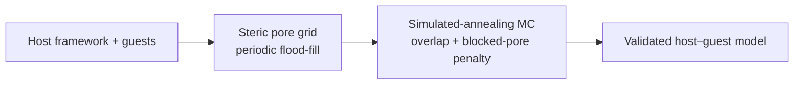

# zeoinsert

**Accessibility-aware Monte Carlo packing of guest molecules in nanoporous frameworks**

[](final/manuscript.pdf)

Construct physically valid host–guest starting structures for zeolites, MOFs, and COFs by coupling a **guest-size-dependent steric pore map** directly into Monte Carlo insertion—unlike geometry-only packers that can seed guests in topologically void but kinetically inaccessible cages.

**Authors:** Jiaao Wang<sup>†,‡</sup>, Xiwen Chi<sup>†</sup>, Weisi Ma<sup>†</sup>, Xiujing Li  
<sup>†</sup> Equal contribution · <sup>‡</sup> Correspondence: [wangjiaao0720@utexas.edu](mailto:wangjiaao0720@utexas.edu)

---

## Why this matters

| Issue | Packmol / geometry-only packing | **zeoinsert (this work)** |
|-------|--------------------------------|---------------------------|
| Sterically closed cages | Guests can be placed inside | Blocked by pore map + penalty |
| Framework / guest clashes | Distance cutoffs only | Unified violation metrics |
| Non-orthogonal unit cells | `inside box` only (orthogonal) | General periodic cells |
| Pore accessibility | Not considered at packing time | Probe-radius flood-fill before insertion |

In FAU zeolite, accessibility-blind packing misplaces **4–12.5%** of CO₂ guests into sodalite cages; our method stays at **0%** across loadings 8–48. Packmol further traps **3–5** guests per application case (electrolyte, CO₂, CO₂/H₂O) versus **zero** for zeoinsert.

---

## Workflow



1. **Steric accessibility** — Voxelize the unit cell; classify solid / accessible / blocked void with a probe radius matched to the guest.
2. **MC packing** — Simulated annealing with guest–framework, guest–guest, and blocked-cage penalties under periodic boundary conditions.
3. **Validation** — Score inaccessible placement, framework clash, and guest overlap with a single post-hoc judge (also applied to Packmol baselines).

---

## Repository layout

```
zeoinsert/
├── pore_accessibility.py    # Voxel grid, periodic flood-fill, probe sweep
├── mc_engine.py             # Simulated-annealing MC pack()
├── error_metrics.py         # Unified physical-violation scoring
├── baselines/run_packmol.py # Packmol wrapper (orthogonal cells)
├── gen_*.py                 # Data generation (cached in runs/)
├── fig*.py                  # Compose Figures 1–4
├── render_ovito.py          # OVITO Tachyon structure renders
├── figures/                 # Paper figures (PDF/PNG) + panel renders
├── final/                   # Full manuscript (MD + PDF build script)
├── runs/                    # Cached numerical results (.npz)
├── frameworks/              # Host CIF structures
└── molecules/               # Guest XYZ geometries
```

**Manuscript:** [`final/manuscript.md`](final/manuscript.md) · [`final/manuscript.pdf`](final/manuscript.pdf)  
**Methods:** [`METHODS.md`](METHODS.md) · **Captions:** [`figures/captions.md`](figures/captions.md)

---

## Installation

**Requirements:** Python 3.10+, [Packmol](https://m3g.github.io/packmol/) (optional, for baselines), [OVITO](https://www.ovito.org/) (for structure rendering).

```bash
git clone git@github.com:JiaaoWANG-ut/zeoinsert.git
cd zeoinsert

python -m venv .venv
source .venv/bin/activate

pip install numpy scipy matplotlib ovito
# Ubuntu/Debian baseline:
# sudo apt install packmol
```

Download framework and molecule files (if not already present):

```bash
python download_structures.py
```

---

## Quick start

### Build a steric pore map

```bash
python probe_pores.py frameworks/zeolites/FAU.cif --probe 2.5 --grid 64
```

### Pack guests with accessibility awareness

```python
from ovito.io import import_file
from mc_engine import pack
from pore_accessibility import PoreGrid, load_framework_ovito

fw = import_file("frameworks/zeolites/FAU.cif").compute()
pos_fw, cell, inv_cell = load_framework_ovito(fw)
grid = PoreGrid.load("frameworks/zeolites/FAU.blocked.npz")

result = pack(
    pos_fw, cell, inv_cell,
    species=[("molecules/CO2.xyz", 32)],
    steric_grid=grid,
    use_blocking=True,
    seed=0,
)
print(result.n_misplaced, "guests in blocked cages")
```

### Reproduce paper figures

Cached data in `runs/` allows figure composition without re-running long simulations:

```bash
# Optional: regenerate data (slow; requires OVITO + Packmol)
python gen_probe_sweep.py
python gen_ablation.py
python gen_applications.py
python gen_generalization.py
python gen_renders.py

# Compose figures
python fig1_overview.py
python fig2_probe_ablation.py
python fig3_applications.py
python fig4_generalization.py
```

Outputs: `figures/fig1_overview.pdf` … `figures/fig4_generalization.pdf`

### Build manuscript PDF

```bash
./final/build_pdf.sh
# -> final/manuscript.pdf
```

---

## Key results (summary)

| Figure | Content |
|--------|---------|
| **Fig. 1** | Four-step workflow; FAU steric map (8 blocked β-cages, 2% volume) |
| **Fig. 2** | Probe-radius sweep; ablation (0% vs 4–12.5% misplacement); MC convergence |
| **Fig. 3** | Electrolyte / CO₂ / separation vs Packmol (0 vs 3–5 closed-cage errors) |
| **Fig. 4** | Six frameworks × four guests; MOF/COF generalization |

Benchmark hosts: **FAU, LTL, ERI, MOF-5, UiO-66, COF-5**  
Guests: **CO₂, H₂O, EC, LiPF₆**

---

## Default parameters

| Parameter | Value |
|-----------|-------|
| Guest–framework / guest–guest cutoff | 2.2 Å |
| Blocked-pore penalty | 100 a.u. |
| Probe radius (generalization) | max(*r*<sub>guest</sub>, 1.8 Å) |
| Grid resolution | 48³ (screening) / 64³ (FAU analysis) |
| MC annealing | *T*₀ = 1.0 → *T*<sub>min</sub> = 0.02, conflict-driven moves |

See [`METHODS.md`](METHODS.md) for full equations and algorithms.

---

## Citation

If you use this code, please cite:

> Wang, J.; Chi, X.; Ma, W.; Li, X. *Accessibility-aware Monte Carlo packing of guest molecules in nanoporous frameworks.* (2026). Code: https://github.com/JiaaoWANG-ut/zeoinsert

---

## License

Contact the authors for licensing questions. Third-party tools ([Packmol](https://m3g.github.io/packmol/), [OVITO](https://www.ovito.org/)) are subject to their own licenses.
