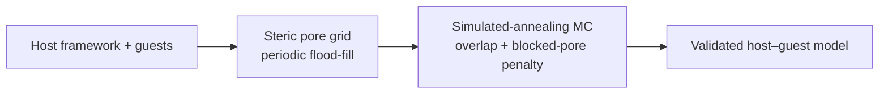
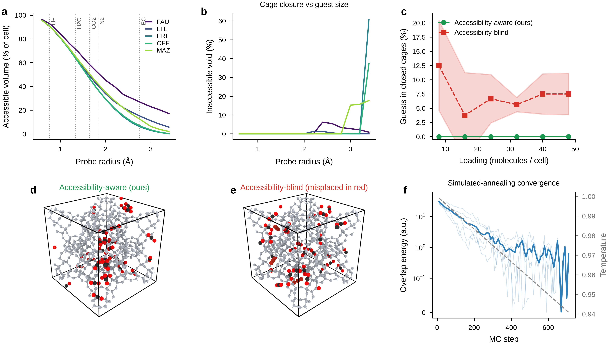
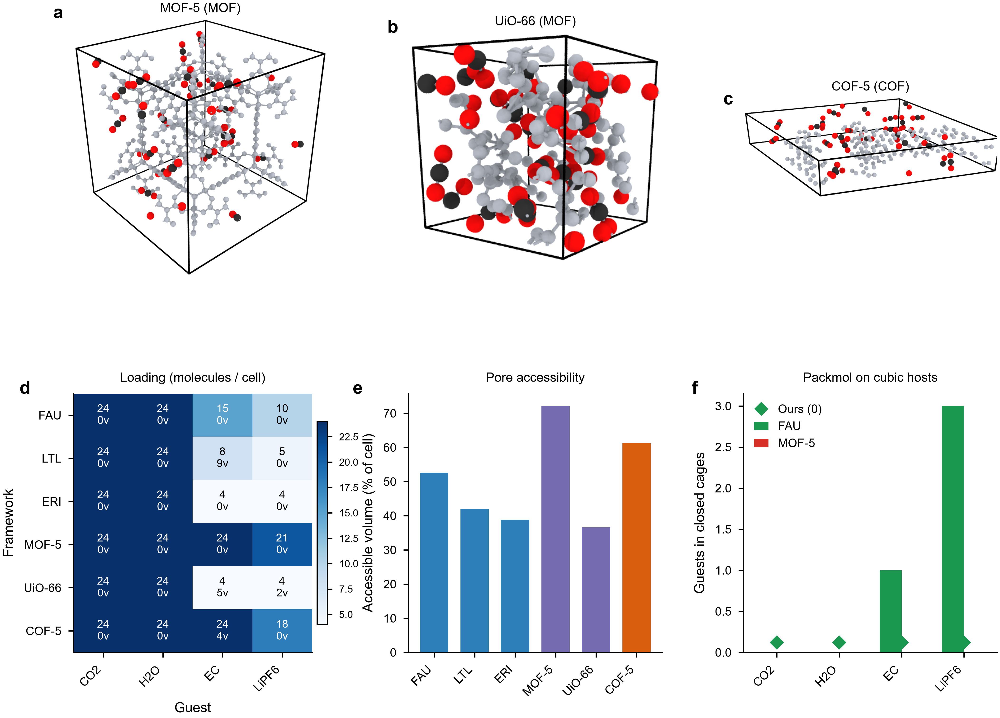

# zeoinsert

**Accessibility-aware Monte Carlo packing of guest molecules in nanoporous frameworks**

Construct physically valid host–guest starting structures for zeolites, MOFs, and COFs by coupling a **guest-size-dependent steric pore map** directly into Monte Carlo insertion—unlike geometry-only packers that can seed guests in topologically void but kinetically inaccessible cages.

---

## Why this matters

| Issue | Packmol / geometry-only packing | **zeoinsert (this work)** |
|-------|--------------------------------|---------------------------|
| Sterically closed cages | Guests can be placed inside | Blocked by pore map + penalty |
| Framework / guest clashes | Distance cutoffs only | Unified violation metrics |
| Non-orthogonal unit cells | `inside box` only (orthogonal) | General periodic cells |
| Pore accessibility | Not considered at packing time | Probe-radius flood-fill before insertion |

In FAU zeolite, accessibility-blind packing misplaces **4–12.5%** of CO₂ guests into sodalite cages; our method stays at **0%** across loadings 8–48. Packmol further traps **3–5** guests per application case (electrolyte, CO₂, CO₂/H₂O) versus **zero** for zeoinsert.

---

## Workflow



1. **Steric accessibility** — Voxelize the unit cell; classify solid / accessible / blocked void with a probe radius matched to the guest.
2. **MC packing** — Simulated annealing with guest–framework, guest–guest, and blocked-cage penalties under periodic boundary conditions.
3. **Validation** — Score inaccessible placement, framework clash, and guest overlap with a single post-hoc judge (also applied to Packmol baselines).

---

## Figures

### Figure 1


* **Fig. 1 | Accessibility-aware packing workflow and pore map in FAU zeolite.** Accessibility-aware Monte Carlo packing workflow and steric pore map in FAU zeolite. **a**, Four-step workflow: (1) host framework and guest library; (2) periodic flood-fill on a voxel grid to classify accessible vs sterically blocked voids (red sodalite cages); (3) simulated-annealing Monte Carlo insertion with blocked-pore penalty; (4) validated host–guest model with guests confined to accessible channels. **b**, Steric accessibility map of FAU showing eight inaccessible sodalite β-cages (red) that are topologically connected in a perfect crystal but closed to guest-sized probes (probe radius 2.5 Å). These regions are invisible to geometry-only packers. **c**, Two-dimensional voxel cross-section (z-slice) of the unit cell: grey, solid framework; blue, accessible void; red, blocked void. **d**, Volume partition of the FAU unit cell (grid 64³): 67% solid, 31% accessible, 2% sterically blocked.

### Figure 2



* **Fig. 2 | Guest-size-dependent pore closure and ablation of accessibility-aware packing.** **a**, Accessible cell volume as a function of probe radius for five frameworks (FAU, LTL, ERI, OFF, MAZ). Vertical dotted lines mark effective radii of Li⁺, H₂O, CO₂, N₂, and EC. **b**, Fraction of void volume that becomes inaccessible (in closed cages) as probe radius increases; ERI and OFF show sharp closure above ~3 Å. **c**, Fraction of CO₂ guests placed in closed cages vs loading in FAU; accessibility-aware packing (green) remains at 0% across loadings 8–48, whereas accessibility-blind packing (red) yields 4–12.5% misplacement (mean ± s.d., five seeds). **d**, OVITO render of accessibility-aware packing: 32 CO₂ molecules in accessible supercages/channels only. **e**, Accessibility-blind packing: misplaced guests highlighted in red trapped in sodalite cages. **f**, Simulated-annealing convergence for 70 CO₂ molecules in FAU (five seeds): overlap penalty energy (blue, symlog scale) and temperature schedule (grey dashed, right axis).

### Figure 3


* **Fig. 3 | Electrolyte, CO₂ adsorption, and CO₂/H₂O separation compared with Packmol.** **a**, Accessibility-aware packing in FAU for three cases (top row): Li-salt electrolyte (EC/DMC/LiPF₆, 20 molecules), CO₂ adsorption (32 CO₂), and CO₂/H₂O competitive loading (16+16). **b**, Packmol baseline (bottom row); guests violating steric accessibility or minimum-distance cutoffs highlighted in red. **c**, Number of guests whose centres fall in closed cages: ours = 0 for all cases; Packmol = 3 (electrolyte), 4 (CO₂), 5 (separation). **d**, Stacked physical violations for Packmol: closed-cage placement (red), framework clash (orange), guest–guest overlap (gold); green diamonds mark zero total violations for our method. **e**, Distribution of minimum guest–framework distances across all cases; vertical dotted line at 2.2 Å cutoff. Packmol shows a tail below the cutoff; ours does not.

### Figure 4



* **Fig. 4 | Generalization across zeolites, MOFs, and COFs.** **a–c**, OVITO renders of accessibility-aware CO₂ packing in representative hosts: MOF-5 (MOF), UiO-66 (MOF), and COF-5 (COF). **d**, Heat map of achieved loading (molecules per unit cell) for six frameworks (FAU, LTL, ERI, MOF-5, UiO-66, COF-5) and four guests (CO₂, H₂O, EC, LiPF₆); annotation `0v` denotes zero physical violations at guest-size-scaled loading; non-zero values report violation counts. **e**, Accessible cell volume fraction (probe 1.8 Å) for each framework, coloured by material class (blue, zeolite; purple, MOF; orange, COF). **f**, Closed-cage misplacement by Packmol on cubic orthogonal hosts (FAU, MOF-5) only; our method achieves zero misplacement (green diamonds). Packmol places 1–3 guests in closed cages for EC/LiPF₆ in FAU. Packmol supports orthogonal cells only; non-orthogonal MOF/COF hosts are shown for our method in **a–c** and **d**.

---

## Repository layout

```
zeoinsert/
├── pore_accessibility.py    # Voxel grid, periodic flood-fill, probe sweep
├── mc_engine.py             # Simulated-annealing MC pack()
├── error_metrics.py         # Unified physical-violation scoring
├── baselines/run_packmol.py # Packmol wrapper (orthogonal cells)
├── gen_*.py                 # Data generation (cached in runs/)
├── fig*.py                  # Compose Figures 1–4
├── render_ovito.py          # OVITO Tachyon structure renders
├── figures/                 # Paper figures (PDF/PNG) + panel renders
├── final/                   # Manuscript source (Markdown)
├── runs/                    # Cached numerical results (.npz)
├── frameworks/              # Host CIF structures
└── molecules/               # Guest XYZ geometries
```

**Manuscript:** [`final/manuscript.md`](final/manuscript.md) · **Methods:** [`METHODS.md`](METHODS.md)

---

## Installation

**Requirements:** Python 3.10+, [Packmol](https://m3g.github.io/packmol/) (optional, for baselines), [OVITO](https://www.ovito.org/) (for structure rendering).

```bash
git clone git@github.com:JiaaoWANG-ut/zeoinsert.git
cd zeoinsert

python -m venv .venv
source .venv/bin/activate

pip install numpy scipy matplotlib ovito
# Ubuntu/Debian baseline:
# sudo apt install packmol
```

Run the geometry regression tests with:

```bash
python -m unittest discover -s tests -v
```

Reviewer-requested grid, cutoff, penalty, and repeated-seed diagnostics can be
reproduced with `python reviewer_experiments.py`. The canonical tabular outputs
are written to `runs/reviewer/`; `packing_sensitivity.csv` is the single source
for the packing diagnostics summarized in the manuscript. On memory-constrained
systems, run the two sections independently with `--section grid` and
`--section packing`.

Download framework and molecule files (if not already present):

```bash
python download_structures.py
```

---

## Quick start

### Build a steric pore map

```bash
python probe_pores.py frameworks/zeolites/FAU.cif --probe 2.5 --grid 64
```

### Pack guests with accessibility awareness

```python
from ovito.io import import_file
from mc_engine import pack
from pore_accessibility import PoreGrid, load_framework_ovito

fw = import_file("frameworks/zeolites/FAU.cif").compute()
pos_fw, cell, inv_cell = load_framework_ovito(fw)
grid = PoreGrid.load("frameworks/zeolites/FAU.blocked.npz")

result = pack(
    pos_fw, cell, inv_cell,
    species=[("molecules/CO2.xyz", 32)],
    steric_grid=grid,
    use_blocking=True,
    seed=0,
)
print(result.n_misplaced, "guests in blocked cages")
```

### Reproduce figures

Cached data in `runs/` allows figure composition without re-running long simulations:

```bash
# Optional: regenerate data (slow; requires OVITO + Packmol)
python gen_probe_sweep.py
python gen_ablation.py
python gen_applications.py
python gen_generalization.py
python gen_renders.py

# Compose figures
python fig1_overview.py
python fig2_probe_ablation.py
python fig3_applications.py
python fig4_generalization.py
```

Outputs: `figures/fig1_overview.pdf` … `figures/fig4_generalization.pdf`

---

## Default parameters

| Parameter | Value |
|-----------|-------|
| Guest–framework / guest–guest cutoff | 2.2 Å |
| Blocked-pore penalty | 100 a.u. |
| Probe radius (generalization) | max(*r*<sub>guest</sub>, 1.8 Å) |
| Grid resolution | 48³ (screening) / 64³ (FAU analysis) |
| MC annealing | *T*₀ = 1.0 → *T*<sub>min</sub> = 0.02, conflict-driven moves |

See [`METHODS.md`](METHODS.md) for full equations and algorithms.

---

## License

Third-party tools ([Packmol](https://m3g.github.io/packmol/), [OVITO](https://www.ovito.org/)) are subject to their own licenses.
