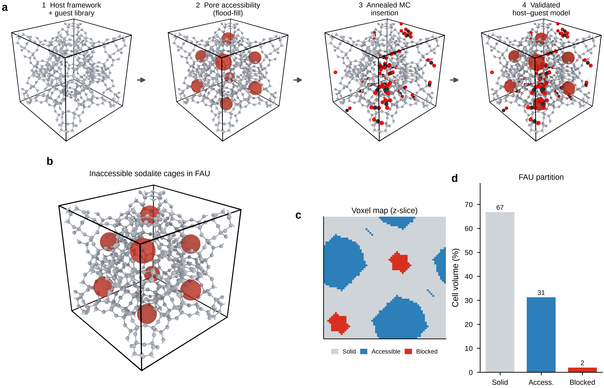
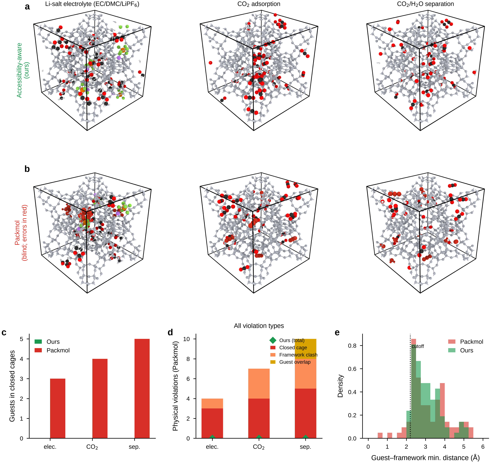

# Accessibility-aware Monte Carlo packing of guest molecules in nanoporous frameworks

**Jiaao Wang**1,†,‡, **Xiwen Chi**2,†, **Weisi Ma**3,†, **Xiujing Li**3

1 Department of Chemistry, The University of Texas at Austin, Austin, TX 78712, USA.

2 Department of Materials Science and Engineering, Stanford University, Stanford, CA 94305, USA.

3 AI4Mat Inc., 710 Lakeway Dr Unit 200, Sunnyvale, CA 94085, USA.

† These authors contributed equally to this work.

‡ Correspondence and requests for materials should be addressed to Jiaao Wang (wangjiaao0720@utexas.edu).

**Author e-mails:** wangjiaao0720@utexas.edu (J.W.); chixiwen@stanford.edu (X.C.); weisi@gmail.com (W.M.); xiujing2015@gmail.com (X.L.).

---

## Abstract

Constructing physically valid host–guest configurations is essential for atomistic studies of gas adsorption, ion transport and separation in zeolites, metal–organic frameworks (MOFs) and covalent organic frameworks (COFs). Conventional molecular packers enforce only minimum interatomic distances and therefore cannot detect cages that are topologically void yet sterically closed to a guest of finite size. Here we introduce an accessibility-aware Monte Carlo packing workflow that couples a guest-size-dependent steric pore map—obtained by periodic flood-fill on a voxel grid—directly into the insertion energy. Across six frameworks and four guest species, the method achieves zero physical violations in nearly all benchmark cases, whereas a geometry-only packer (Packmol) systematically traps guests in inaccessible pores. Probe-radius analysis reveals that accessible volume decreases in discrete steps as guest size increases, and ablation confirms that accessibility-aware packing achieves 0% misplacement where blind packing yields up to 12.5% trapped guests in FAU zeolite. The workflow transfers without modification from zeolites to MOFs and COFs and provides physically realizable starting structures for molecular dynamics and high-throughput screening.

**Keywords:** host–guest modelling; nanoporous materials; Monte Carlo packing; pore accessibility; molecular simulation

---

## Introduction

Crystalline nanoporous materials—zeolites, metal–organic frameworks (MOFs) and covalent organic frameworks (COFs)—provide high-surface-area, chemically tunable scaffolds that underpin gas storage, molecular separation, ion transport and heterogeneous catalysis1–4. The principle of reticular chemistry, in which molecular building blocks are assembled into predictable extended networks, has expanded this design space to a practically unlimited number of candidate frameworks1. This explosion of structures has, in turn, motivated large curated repositories such as the IZA Database of Zeolite Structures5, the Computation-Ready, Experimental MOF (CoRE MOF) database6, hypothetical-MOF libraries7, and the CURATED COFs collection8, which together place over one hundred thousand framework structures within reach of computational study.

Molecular simulation has become the workhorse for navigating this space. High-throughput computational screening, typically built on grand canonical Monte Carlo (GCMC) sampling of adsorption, now routinely ranks thousands to millions of frameworks for a target application and guides experimental synthesis3,4,9,10. Molecular dynamics and many other atomistic workflows require a physically valid host–guest starting configuration; adsorption simulations likewise depend on whether trial insertions can reach the void regions being sampled11,12. The fidelity of this initial placement therefore propagates directly into the reliability of downstream predictions.

Two broad strategies are used to generate these starting structures. General-purpose packing tools such as Packmol build initial configurations by solving a constrained optimization that enforces a minimum interatomic separation between all atoms, treating the framework as a static obstacle field13,14. Packmol further restricts guest placement to orthogonal bounding boxes (`inside box` constraints) and therefore cannot be applied directly to unit cells with non-orthogonal lattice vectors—a limitation that excludes many MOFs and COFs from automated packing workflows. Random-insertion moves in GCMC similarly propose trial positions that are accepted or rejected on the basis of interaction energy and Boltzmann statistics12. Both views are adequate for open, continuously connected pore spaces, but they share a blind spot: a cavity may be topologically void in the perfect crystal yet sterically closed to a molecule of finite size, because the windows connecting it to the percolating network are narrower than the guest.

The geometric characterization of pore space is itself a mature field. Tools such as Zeo++, which performs a Voronoi decomposition of the void space, and the grid-based PoreBlazer compute pore-size distributions, accessible surface areas and accessible volumes for a spherical probe of a chosen radius, and can identify guest-inaccessible regions15,16. In the specific context of adsorption simulations, the standard remedy for inaccessible pockets is "pore blocking": a flood-fill or energy-grid segmentation isolates disconnected cavities, which are then excluded from sampling either by inserting repulsive blocking spheres or by setting their grid energies to prohibitively large values17–19. Neglecting this step is known to cause systematic overestimation of uptake, and its importance has been documented repeatedly across zeolites and MOFs17,18. Crucially, however, these accessibility analyses have been developed to *count* adsorption correctly within GCMC, and they remain decoupled from the general-purpose packers used to *build* host–guest structures for molecular dynamics: the packer enforces distances, while accessibility is treated, if at all, as a separate post hoc correction.

This gap has tangible consequences. The molecular-sieving effect—long established in zeolite chemistry—dictates precisely which species can enter the internal pore space of a framework20. When a packer or insertion algorithm seeds a guest inside a cage whose windows are too small for it to traverse, the resulting configuration is kinetically trapped: the molecule can neither enter nor leave during a physical experiment, and any trajectory launched from such a state samples a non-equilibrium ensemble, biasing predicted loadings, distorting diffusion pathways and skewing free-energy estimates. A geometry-only packer such as Packmol will therefore generate configurations that appear clash-free yet are physically unrealizable13,14.

Here we introduce an accessibility-aware Monte Carlo packing workflow that couples a guest-size-dependent steric pore map directly into the insertion energy. By analysing the three-dimensional connectivity of the pore network with a probe radius matched to the guest, the algorithm distinguishes open, accessible cages from sterically closed voids *before* any molecule is placed, and penalizes blocked-cage occupancy during simulated annealing rather than correcting for it afterwards. The workflow operates on general periodic unit cells and does not require orthogonal box constraints. We show that the method eliminates closed-cage placements and framework clashes across a diverse set of nanoporous materials—zeolites, MOFs and COFs—whereas a state-of-the-art geometry-only packer (Packmol) systematically traps guests in inaccessible pores on the subset of hosts where it is applicable.

---

## Results

### An accessibility-aware packing workflow

Our workflow proceeds in four stages (**Fig. 1a**): (1) the host framework and a guest molecule library are loaded; (2) a periodic flood-fill on a voxel grid partitions the unit cell into solid framework, accessible void and sterically blocked void; (3) simulated-annealing MC inserts guests under a combined overlap and blocked-pore penalty; and (4) the validated host–guest model confines all guests to accessible channels. The central physical object is the steric accessibility map. For FAU zeolite probed at a guest-sized radius of 2.5 Å, eight sodalite β-cages are classified as inaccessible (**Fig. 1b**, red), even though they remain topologically connected in the ideal crystal. These regions are precisely the volumes that geometry-only packers cannot detect.

A two-dimensional voxel cross-section makes the partition explicit (**Fig. 1c**): grey voxels are solid framework, blue voxels are accessible void, and red voxels are blocked void. Integrating over the full grid (64³), the FAU unit cell decomposes into 67% solid, 31% accessible and 2% sterically blocked volume (**Fig. 1d**). The blocked fraction is small but, as shown below, decisive for the physical validity of the packed model.

**Fig. 1 | Accessibility-aware packing workflow and pore map in FAU zeolite.** **a**, Four-step workflow: (1) host framework and guest library; (2) periodic flood-fill on a voxel grid to classify accessible vs sterically blocked voids (red sodalite cages); (3) simulated-annealing Monte Carlo insertion with blocked-pore penalty; (4) validated host–guest model with guests confined to accessible channels. **b**, Steric accessibility map of FAU showing eight inaccessible sodalite β-cages (red) that are topologically connected in a perfect crystal but closed to guest-sized probes (probe radius 2.5 Å). These regions are invisible to geometry-only packers. **c**, Two-dimensional voxel cross-section (z-slice) of the unit cell: grey, solid framework; blue, accessible void; red, blocked void. **d**, Volume partition of the FAU unit cell (grid 64³): 67% solid, 31% accessible, 2% sterically blocked.

### Probe physics and the cost of accessibility blindness

Pore accessibility is intrinsically guest-size dependent. Scanning the probe radius reveals that the accessible cell volume decreases in discrete steps as the probe grows (**Fig. 2a**), each step corresponding to a window closing to molecules of a given size; vertical markers indicate the effective radii of Li⁺, H₂O, CO₂, N₂ and ethylene carbonate (EC). The complementary quantity—the fraction of void volume locked inside closed cages—rises sharply for cage-type frameworks such as ERI and OFF above ~3 Å (**Fig. 2b**), confirming that accessibility cannot be inferred from a single static pore network.

To quantify the consequence for packing, we measured the fraction of CO₂ guests placed in closed cages as a function of loading in FAU (**Fig. 2c**). Accessibility-aware packing remains at 0% misplacement across loadings of 8–48 molecules, whereas accessibility-blind packing traps 4–12.5% of guests (mean ± s.d., five seeds). The structural origin is visualized in **Fig. 2d**, where 32 CO₂ molecules occupy only accessible supercages and channels, versus **Fig. 2e**, where accessibility-blind insertion strands several guests (red) inside sodalite cages. The MC engine converges reliably: for 70 CO₂ molecules in FAU, the overlap penalty energy decays to zero under the linear annealing schedule across all five seeds (**Fig. 2f**).

**Fig. 2 | Guest-size-dependent pore closure and ablation of accessibility-aware packing.** **a**, Accessible cell volume as a function of probe radius for five frameworks (FAU, LTL, ERI, OFF, MAZ). Vertical dotted lines mark effective radii of Li⁺, H₂O, CO₂, N₂, and EC. **b**, Fraction of void volume that becomes inaccessible (in closed cages) as probe radius increases; ERI and OFF show sharp closure above ~3 Å. **c**, Fraction of CO₂ guests placed in closed cages vs loading in FAU; accessibility-aware packing (green) remains at 0% across loadings 8–48, whereas accessibility-blind packing (red) yields 4–12.5% misplacement (mean ± s.d., five seeds). **d**, OVITO render of accessibility-aware packing: 32 CO₂ molecules in accessible supercages/channels only. **e**, Accessibility-blind packing: misplaced guests highlighted in red trapped in sodalite cages. **f**, Simulated-annealing convergence for 70 CO₂ molecules in FAU (five seeds): overlap penalty energy (blue, symlog scale) and temperature schedule (grey dashed, right axis).

### Application cases outperform a geometry-only baseline

We next benchmarked three representative loading scenarios in FAU against Packmol (**Fig. 3a,b**): a Li-salt electrolyte (EC/DMC/LiPF₆, 20 molecules), CO₂ adsorption (32 CO₂), and competitive CO₂/H₂O loading (16+16). In every case our method places all guests in accessible space (**Fig. 3a**), whereas Packmol seeds guests that violate steric accessibility or minimum-distance cutoffs (**Fig. 3b**, red).

Counting guests whose centres fall in closed cages, our method yields zero across all three cases, while Packmol traps 3 (electrolyte), 4 (CO₂) and 5 (separation) guests (**Fig. 3c**). Decomposing the Packmol failures by type—closed-cage placement, framework clash and guest–guest overlap—shows that all three violation modes occur, whereas our method registers zero total violations in every case (**Fig. 3d**, green diamonds). The distribution of minimum guest–framework distances summarizes the difference (**Fig. 3e**): Packmol exhibits a tail below the 2.2 Å cutoff, indicating physical clashes, while our distribution lies entirely above it.

**Fig. 3 | Electrolyte, CO₂ adsorption, and CO₂/H₂O separation compared with Packmol.** **a**, Accessibility-aware packing in FAU for three cases (top row): Li-salt electrolyte (EC/DMC/LiPF₆, 20 molecules), CO₂ adsorption (32 CO₂), and CO₂/H₂O competitive loading (16+16). **b**, Packmol baseline (bottom row); guests violating steric accessibility or minimum-distance cutoffs highlighted in red. **c**, Number of guests whose centres fall in closed cages: ours = 0 for all cases; Packmol = 3 (electrolyte), 4 (CO₂), 5 (separation). **d**, Stacked physical violations for Packmol: closed-cage placement (red), framework clash (orange), guest–guest overlap (gold); green diamonds mark zero total violations for our method. **e**, Distribution of minimum guest–framework distances across all cases; vertical dotted line at 2.2 Å cutoff. Packmol shows a tail below the cutoff; ours does not.

### Generalization across zeolites, MOFs and COFs

Finally, we tested transferability beyond zeolites. Accessibility-aware packing produces clash-free CO₂ configurations in MOF-5, UiO-66 and COF-5 (**Fig. 4a–c**). Across a matrix of six frameworks (FAU, LTL, ERI, MOF-5, UiO-66, COF-5) and four guests (CO₂, H₂O, EC, LiPF₆), the method achieves guest-size-scaled loadings with zero physical violations in nearly all cells (**Fig. 4d**, annotated `0v`). The underlying accessible volume fraction varies systematically with material class (**Fig. 4e**): zeolites, MOFs and COFs span a wide range of porosity, yet the packing remains valid throughout.

On the orthogonal hosts where Packmol is applicable (FAU, MOF-5), the geometry-only baseline again places 1–3 guests in closed cages for the larger EC/LiPF₆ species, whereas our method achieves zero misplacement (**Fig. 4f**, green diamonds). Because Packmol supports orthogonal cells only, the non-orthogonal MOF and COF hosts are reported for our method alone (**Fig. 4a–c,d**).

**Fig. 4 | Generalization across zeolites, MOFs, and COFs.** **a–c**, OVITO renders of accessibility-aware CO₂ packing in representative hosts: MOF-5 (MOF), UiO-66 (MOF), and COF-5 (COF). **d**, Heat map of achieved loading (molecules per unit cell) for six frameworks (FAU, LTL, ERI, MOF-5, UiO-66, COF-5) and four guests (CO₂, H₂O, EC, LiPF₆); annotation `0v` denotes zero physical violations at guest-size-scaled loading; non-zero values report violation counts. **e**, Accessible cell volume fraction (probe 1.8 Å) for each framework, coloured by material class (blue, zeolite; purple, MOF; orange, COF). **f**, Closed-cage misplacement by Packmol on cubic orthogonal hosts (FAU, MOF-5) only; our method achieves zero misplacement (green diamonds). Packmol places 1–3 guests in closed cages for EC/LiPF₆ in FAU. Packmol supports orthogonal cells only; non-orthogonal MOF/COF hosts are shown for our method in **a–c** and **d**.

---

## Discussion

Across all tested systems, coupling a guest-size-dependent steric accessibility map into the MC insertion energy is sufficient to eliminate the closed-cage placements and framework clashes that geometry-only packers produce. The accessible-volume analysis (**Fig. 2a,b**; **Fig. 4e**) shows why a single distance cutoff is inadequate: accessibility is a function of guest size, not of the host alone, and it changes discontinuously as windows close. By making this constraint explicit, the workflow yields host–guest models that are physically realizable starting points for molecular dynamics and free-energy calculations, and it transfers without modification from zeolites to MOFs and COFs (**Fig. 4**). We anticipate that accessibility-aware packing will be particularly valuable for high-throughput screening, where manual inspection of every packed structure is infeasible and silently trapped guests would otherwise corrupt downstream property predictions.

---

## Methods

### Overview

We developed an **accessibility-aware Monte Carlo (MC) packing** workflow to construct physically valid host–guest structures for periodic porous frameworks (zeolites, MOFs, COFs). The method combines (i) a guest-size-dependent steric pore map obtained by periodic flood-fill on a voxel grid, and (ii) simulated-annealing MC insertion with overlap penalties and a blocked-pore penalty. Unlike geometry-only packers (e.g. Packmol), our approach prevents guest molecules from being placed in sterically closed cages that are topologically void but inaccessible to molecules of a given size.

The workflow comprises four steps: (1) load host framework and guest molecular geometries; (2) build a steric accessibility grid; (3) perform MC packing with accessibility constraints; (4) validate the final structure against unified physical-violation metrics.

### Periodic geometry and minimum-image convention

The host unit cell is defined by a $3 \times 3$ matrix $\mathbf{H}$ whose rows are the lattice vectors $\mathbf{a}$, $\mathbf{b}$, $\mathbf{c}$. Cartesian coordinates $\mathbf{r}$ and fractional coordinates $\mathbf{f}$ are related by

$$
\mathbf{r} = \mathbf{f}\,\mathbf{H}, \qquad \mathbf{f} = \mathbf{r}\,\mathbf{H}^{-1}.
$$

All interatomic distances are evaluated under **minimum-image convention** (MIC). For displacement vectors $\{\Delta\mathbf{r}_k\}$, the MIC-adjusted displacement is

$$
\Delta\mathbf{r}_k^{\mathrm{MIC}} = \Delta\mathbf{r}_k - \mathrm{round}(\Delta\mathbf{f}_k)\,\mathbf{H},
\qquad \Delta\mathbf{f}_k = \Delta\mathbf{r}_k\,\mathbf{H}^{-1},
$$

and the minimum distance between point sets $A$ and $B$ is

$$
d_{\min}(A,B) = \min_{i,j} \left\|\Delta\mathbf{r}_{ij}^{\mathrm{MIC}}\right\|.
$$

Guest centres are wrapped into the unit cell via $\mathbf{f} \leftarrow \mathbf{f} - \lfloor \mathbf{f} \rfloor$.

### Steric pore accessibility analysis

#### Voxelization

The unit cell is discretized into an $N_g \times N_g \times N_g$ grid ($N_g = 48$–$64$ in this work). Voxel centres in fractional coordinates are

$$
\mathbf{f}_{ijk} = \frac{1}{N_g}\left(i+\tfrac{1}{2},\, j+\tfrac{1}{2},\, k+\tfrac{1}{2}\right),
\qquad i,j,k \in \{0,\ldots,N_g-1\}.
$$

For each voxel centre $\mathbf{r}_{ijk} = \mathbf{f}_{ijk}\mathbf{H}$, the distance to the nearest framework atom is computed (via a $3\times3\times3$ replicated KD-tree for efficiency). A voxel is classified as **solid** if

$$
d_{\min}(\mathbf{r}_{ijk},\,\text{framework}) < r_{\mathrm{probe}},
$$

where $r_{\mathrm{probe}}$ is the probe radius, set to match the effective radius of the guest species (typically 1.2–2.5 Å). Remaining voxels constitute the **void** set $\mathcal{V}$.

#### Topological vs steric accessibility

Two probe modes are distinguished:

| Mode | $r_{\mathrm{probe}}$ | Physical meaning |
|------|---------------------|----------------|
| Topological | 1.2 Å | Small probe; detects only truly enclosed voids in a perfect crystal |
| Steric | $\approx r_{\mathrm{guest}}$ | Guest-sized probe; marks cages/windows too narrow for the target molecule |

For zeolite FAU with $r_{\mathrm{probe}} = 2.5$ Å, eight sodalite $\beta$-cages (644 voxels each at $N_g=64$) are sterically blocked despite being topologically connected in the perfect structure.

#### Periodic flood-fill

Void voxels are partitioned into connected components using 26-neighbour connectivity on a non-periodic label field, followed by **union–find merging** of labels that touch across opposite unit-cell faces (to recover periodicity).

A void component $C \subseteq \mathcal{V}$ is **accessible** if it touches at least one face of the unit cell:

$$
C \cap \partial\Omega \neq \varnothing,
$$

where $\partial\Omega$ denotes the union of the six cell-boundary voxel layers. The accessible void set is

$$
\mathcal{A} = \bigcup \left\{ C \subseteq \mathcal{V} \;\middle|\; C \cap \partial\Omega \neq \varnothing \right\}.
$$

**Blocked** void voxels are initially $\mathcal{B}_{\mathrm{raw}} = \mathcal{V} \setminus \mathcal{A}$. Isolated speckle clusters smaller than $n_{\min}$ voxels (default $n_{\min}=4$) are reassigned to $\mathcal{A}$ to suppress grid discretization artefacts. Manual blocked regions can be appended for user-defined confinement.

The accessible volume fraction is

$$
\phi_{\mathrm{acc}} = \frac{|\mathcal{A}|}{N_g^3},
\qquad
\phi_{\mathrm{blocked}} = \frac{|\mathcal{B}|}{|\mathcal{V}|}.
$$

#### Probe-radius sweep

To quantify guest-size-dependent pore closure, $r_{\mathrm{probe}}$ is scanned over $[0.6,\,3.4]$ Å in steps of 0.2 Å. For each radius, $\phi_{\mathrm{acc}}(r_{\mathrm{probe}})$ and $\phi_{\mathrm{blocked}}(r_{\mathrm{probe}})$ are recorded, revealing step-like reductions in accessible volume when cage windows close to probes of increasing size.

### Guest molecular representation

Each guest species $s$ is provided as an atomic coordinate file (XYZ). Atoms are centred at the origin:

$$
\mathbf{p}_a^{(s)} \leftarrow \mathbf{p}_a^{(s)} - \frac{1}{N_s}\sum_{a=1}^{N_s}\mathbf{p}_a^{(s)}.
$$

Guest molecule $i$ of species $s_i$ is placed by a **centre** $\mathbf{f}_i$ (fractional) and a **rotation** $\mathbf{R}_i \in \mathrm{SO}(3)$:

$$
\mathbf{x}_{i,a} = \mathbf{R}_i\,\mathbf{p}_a^{(s_i)} + \mathbf{f}_i\,\mathbf{H},
\qquad a = 1,\ldots,N_{s_i}.
$$

Rotations are drawn uniformly on $\mathrm{SO}(3)$ via the quaternion method; small rotations for local MC moves are generated by the axis–angle (Rodrigues) formula.

For multi-species loading, species counts are assigned either explicitly or by stoichiometric ratio with largest-remainder apportionment.

### Overlap energy function

The total overlap energy is a sum of three pairwise penalty terms:

$$
E = E_{\mathrm{fw}} + E_{\mathrm{gg}} + E_{\mathrm{block}}.
$$

#### Guest–framework overlap

For guest $i$ with framework cutoff $d_{\mathrm{fw}}^{(i)}$ (default 2.2 Å):

$$
E_{\mathrm{fw}} = \sum_{i=1}^{N_{\mathrm{mol}}} \max\!\left(0,\; d_{\mathrm{fw}}^{(i)} - d_{\min}^{(i,\mathrm{fw})} \right)^2,
$$

where $d_{\min}^{(i,\mathrm{fw})} = d_{\min}(\text{atoms of guest } i,\,\text{framework})$ under MIC.

#### Guest–guest overlap

For each unordered pair $(i,j)$, $i<j$, with cutoff $d_{\mathrm{mm}}^{(ij)} = \max(d_{\mathrm{mm}}^{(i)}, d_{\mathrm{mm}}^{(j)})$:

$$
E_{\mathrm{gg}} = \sum_{i<j} \max\!\left(0,\; d_{\mathrm{mm}}^{(ij)} - d_{\min}^{(ij)} \right)^2.
$$

#### Blocked-pore penalty

When accessibility-aware packing is enabled, a flat penalty is applied if the centre of guest $i$ falls in a blocked voxel:

$$
E_{\mathrm{block}} = \sum_{i=1}^{N_{\mathrm{mol}}} \lambda_{\mathrm{block}}\,\mathbb{1}\!\left[\mathbf{f}_i \in \mathcal{B}\right],
\qquad \lambda_{\mathrm{block}} = 100\;\text{a.u.}
$$

Voxel membership is determined by $\lfloor \mathbf{f}_i \cdot N_g \rfloor \mod N_g$. When accessibility blocking is disabled (ablation baseline), $E_{\mathrm{block}} \equiv 0$ but misplacement is still measured post hoc against the steric grid.

### Simulated-annealing Monte Carlo packing

#### Initialization

Each guest centre $\mathbf{f}_i$ is drawn uniformly from accessible voxel centres $\{\mathbf{f} : \mathbf{f} \in \mathcal{A}\}$ (or uniformly in the unit cell if no grid is used). Rotations $\mathbf{R}_i$ are random. The initial energy $E$ is computed from the overlap function above.

#### Move types

At each MC step, the guest with the largest per-molecule conflict score

$$
c_i = e_{\mathrm{fw}}^{(i)} + e_{\mathrm{block}}^{(i)} + \sum_{j \neq i} e_{\mathrm{gg}}^{(ij)}
$$

is selected for trial displacement. Three move types are applied with probabilities $(p_{\mathrm{small}}, p_{\mathrm{jump}}, p_{\mathrm{rot}}) = (0.70,\,0.10,\,0.20)$:

1. **Small move** ($p_{\mathrm{small}}$): translate centre by $\Delta\mathbf{r} = \delta_t \,\boldsymbol{\xi}$ ($\boldsymbol{\xi}$ unit random vector, $\delta_t = 0.8$ Å) and apply a small random rotation (maximum angle ±20°).
2. **Big jump** ($p_{\mathrm{jump}}$): re-sample $\mathbf{f}_i$ from $\mathcal{A}$ and draw a new uniform $\mathbf{R}_i$.
3. **Large rotation** ($p_{\mathrm{rot}}$): keep centre fixed, apply random rotation up to ±60°.

#### Metropolis acceptance with linear cooling

The temperature schedule is linear:

$$
T(n) = \max\!\left(T_{\min},\; T_0\left(1 - \frac{n}{N_{\mathrm{MC}}}\right)\right),
\qquad T_0 = 1.0,\; T_{\min} = 0.02,
$$

where $n$ is the MC step and $N_{\mathrm{MC}}$ is the maximum iteration count (typically $8\times10^3$–$3\times10^4$).

A trial move changing the energy by $\Delta E$ is accepted with Metropolis probability

$$
P_{\mathrm{acc}} = \min\!\left(1,\; \exp\!\left(-\frac{\Delta E}{T(n)}\right)\right).
$$

Moves with $\Delta E \le 0$ are always accepted. Energy differences are evaluated incrementally (only terms involving the moved molecule are recomputed).

#### Convergence criterion

The simulation terminates when $E < \varepsilon$ with $\varepsilon = 10^{-6}$ a.u., or when $N_{\mathrm{MC}}$ steps are reached.

### Physical-violation metrics (validation)

All packing methods (ours, Packmol, accessibility-blind ablation) are scored by the same post hoc judge:

| Metric | Criterion | Definition |
|--------|-----------|------------|
| Inaccessible placement | Centre in $\mathcal{B}$ | $\mathbb{1}[\mathbf{f}_i \in \mathcal{B}]$ |
| Framework clash | $d_{\min}^{(i,\mathrm{fw})} < d_{\mathrm{fw}}$ | Per-molecule minimum guest–framework distance |
| Guest overlap | $d_{\min}^{(ij)} < d_{\mathrm{mm}}$ | Per-molecule pair count |

The total violation count for $N_{\mathrm{mol}}$ guests is

$$
N_{\mathrm{viol}} = N_{\mathrm{inacc}} + N_{\mathrm{gf}} + N_{\mathrm{gg}},
$$

where $N_{\mathrm{inacc}} = \sum_i \mathbb{1}[\mathbf{f}_i \in \mathcal{B}]$, $N_{\mathrm{gf}}$ counts molecules with framework clash, and $N_{\mathrm{gg}}$ counts molecules involved in at least one guest–guest overlap.

### Baseline: Packmol

As an external geometry-only baseline, we used Packmol v21.2.1. The framework atoms are supplied as a fixed `structure` with zero degrees of freedom; guest molecules are inserted with `inside box` constraints and a global `tolerance` of 2.2 Å (matching our overlap cutoffs). Packmol enforces minimum interatomic distances but has **no knowledge of pore accessibility** and therefore can place guests in sterically closed cages. Packmol supports orthogonal unit cells only; non-orthogonal MOF/COF hosts are evaluated with our method alone.

### Target loading for cross-framework generalization

For each framework–guest pair, the target number of molecules per unit cell is scaled by accessible volume and inversely by guest size (relative to CO₂, $r_{\mathrm{CO}_{2}} = 1.65\,\mathrm{\AA}$):

$$
N_{\mathrm{target}} = \min\!\left(N_{\mathrm{load,max}},\; \max\!\left(4,\; \left\lfloor \frac{|\mathcal{A}|}{700}\left(\frac{r_{\mathrm{CO}_{2}}}{r_{\mathrm{guest}}}\right)^2 \right\rfloor \right)\right),
\qquad N_{\mathrm{load,max}} = 24.
$$

The steric grid for each pair uses $r_{\mathrm{probe}} = \max(r_{\mathrm{guest}},\,1.8\,\mathrm{\AA})$.

### Computational details

| Parameter | Value |
|-----------|-------|
| Grid resolution $N_g$ | 48 (generalization) / 64 (FAU analysis) |
| Connectivity | 26-neighbour |
| Min. blocked cluster size | 4 voxels |
| Framework cutoff $d_{\mathrm{fw}}$ | 2.2 Å |
| Guest–guest cutoff $d_{\mathrm{mm}}$ | 2.2 Å |
| Blocked-pore penalty $\lambda_{\mathrm{block}}$ | 100 a.u. |
| Translation step $\delta_t$ | 0.8 Å |
| Small rotation limit | ±20° |
| Large rotation limit | ±60° |
| $T_0 / T_{\min}$ | 1.0 / 0.02 |
| MC steps $N_{\mathrm{MC}}$ | $8\times10^3$–$3\times10^4$ |

Structures are read/written in CIF/XYZ format via OVITO 3.15. Pore grids are cached as compressed NumPy archives (`.npz`). High-quality structure figures are rendered with OVITO TachyonRenderer (ambient occlusion, CPK colouring).

All calculations were performed on a single CPU (Python 3.12, NumPy 2.4, SciPy 1.18). Typical wall times: steric grid build ~1.5 s per framework ($N_g=64$); MC packing of 32 CO₂ in FAU ~1–3 s; Packmol baseline ~1 s.

### Statistical analysis

Ablation data (accessibility-aware vs blind packing) report mean ± s.d. over five random seeds ($s = 0,1,2,3,4$) at each loading level. Convergence traces show individual seed trajectories and the seed-averaged overlap energy. Probe-radius sweeps are deterministic (no stochastic component).

---

## Data and code availability

Source code for the accessibility-aware packing workflow, figure-generation scripts, and cached numerical results are available at https://github.com/JiaaoWANG-ut/zeoinsert. Framework structures were obtained from the IZA Database, WMD-group MOF collection, and CURATED-COFs. Guest molecular geometries were retrieved from PubChem.

---

## References

1. Yaghi, O. M.; O'Keeffe, M.; Ockwig, N. W.; Chae, H. K.; Eddaoudi, M.; Kim, J. Reticular synthesis and the design of new materials. *Nature* **2003**, *423*, 705–714. DOI: 10.1038/nature01650.

2. Furukawa, H.; Cordova, K. E.; O'Keeffe, M.; Yaghi, O. M. The chemistry and applications of metal–organic frameworks. *Science* **2013**, *341*, 1230444. DOI: 10.1126/science.1230444.

3. Smit, B.; Maesen, T. L. M. Molecular simulations of zeolites: Adsorption, diffusion, and shape selectivity. *Chem. Rev.* **2008**, *108*, 4125–4184. DOI: 10.1021/cr8002642.

4. Düren, T.; Bae, Y.-S.; Snurr, R. Q. Using molecular simulation to characterise metal–organic frameworks for adsorption applications. *Chem. Soc. Rev.* **2009**, *38*, 1237–1247. DOI: 10.1039/b803498m.

5. Baerlocher, C.; McCusker, L. B. Database of Zeolite Structures. International Zeolite Association, http://www.iza-structure.org/databases/.

6. Chung, Y. G.; et al. Advances, updates, and analytics for the computation-ready, experimental metal–organic framework database: CoRE MOF 2019. *J. Chem. Eng. Data* **2019**, *64*, 5985–5998. DOI: 10.1021/acs.jced.9b00835.

7. Wilmer, C. E.; Leaf, M.; Lee, C. Y.; Farha, O. K.; Hauser, B. G.; Hupp, J. T.; Snurr, R. Q. Large-scale screening of hypothetical metal–organic frameworks. *Nat. Chem.* **2012**, *4*, 83–89. DOI: 10.1038/nchem.1192.

8. Ongari, D.; Yakutovich, A. V.; Talirz, L.; Smit, B. Building a consistent and reproducible database for adsorption evaluation in covalent–organic frameworks. *ACS Cent. Sci.* **2019**, *5*, 1663–1675. DOI: 10.1021/acscentsci.9b00619.

9. Colón, Y. J.; Snurr, R. Q. High-throughput computational screening of metal–organic frameworks. *Chem. Soc. Rev.* **2014**, *43*, 5735–5749. DOI: 10.1039/C4CS00070F.

10. Boyd, P. G.; Lee, Y.; Smit, B. Computational development of the nanoporous materials genome. *Nat. Rev. Mater.* **2017**, *2*, 17037. DOI: 10.1038/natrevmats.2017.37.

11. Ernst, M.; Evans, J. D.; Gryn'ova, G. Host–guest interactions in framework materials: Insight from modeling. *Chem. Phys. Rev.* **2023**, *4*, 041303. DOI: 10.1063/5.0144827.

12. Frenkel, D.; Smit, B. *Understanding Molecular Simulation: From Algorithms to Applications*, 2nd ed.; Academic Press: San Diego, 2002.

13. Martínez, J. M.; Martínez, L. Packing optimization for automated generation of complex system's initial configurations for molecular dynamics and docking. *J. Comput. Chem.* **2003**, *24*, 819–825. DOI: 10.1002/jcc.10216.

14. Martínez, L.; Andrade, R.; Birgin, E. G.; Martínez, J. M. Packmol: A package for building initial configurations for molecular dynamics simulations. *J. Comput. Chem.* **2009**, *30*, 2157–2164. DOI: 10.1002/jcc.21224.

15. Willems, T. F.; Rycroft, C. H.; Kazi, M.; Meza, J. C.; Haranczyk, M. Algorithms and tools for high-throughput geometry-based analysis of crystalline porous materials. *Microporous Mesoporous Mater.* **2012**, *149*, 134–141. DOI: 10.1016/j.micromeso.2011.08.020.

16. Sarkisov, L.; Harrison, A. Computational structure characterisation tools in application to ordered and disordered porous materials. *Mol. Simul.* **2011**, *37*, 1248–1257. DOI: 10.1080/08927022.2011.592832.

17. Gómez-Álvarez, P.; Ruiz-Salvador, A. R.; Hamad, S.; Calero, S. Importance of blocking inaccessible voids on modeling zeolite adsorption: Revisited. *J. Phys. Chem. C* **2017**, *121*, 4462–4470. DOI: 10.1021/acs.jpcc.7b00031.

18. Zhang, K.; Nalaparaju, A.; Chen, Y.; Jiang, J. Crucial role of blocking inaccessible cages in the simulation of gas adsorption in a paddle-wheel metal–organic framework. *RSC Adv.* **2013**, *3*, 16152–16158. DOI: 10.1039/c3ra42213e.

19. Kim, J.; Martin, R. L.; Rübel, O.; Haranczyk, M.; Smit, B. High-throughput characterization of porous materials using graphics processing units. *J. Chem. Theory Comput.* **2012**, *8*, 1684–1693. DOI: 10.1021/ct200787v.

20. Breck, D. W. *Zeolite Molecular Sieves: Structure, Chemistry and Use*; Wiley: New York, 1974.

---

## Extended Data

Print-quality figure files (PDF) are included in `figures/`:

| Figure | PNG | PDF |
|--------|-----|-----|
| Fig. 1 | `figures/fig1_overview.png` | `figures/fig1_overview.pdf` |
| Fig. 2 | `figures/fig2_probe_ablation.png` | `figures/fig2_probe_ablation.pdf` |
| Fig. 3 | `figures/fig3_applications.png` | `figures/fig3_applications.pdf` |
| Fig. 4 | `figures/fig4_generalization.png` | `figures/fig4_generalization.pdf` |
